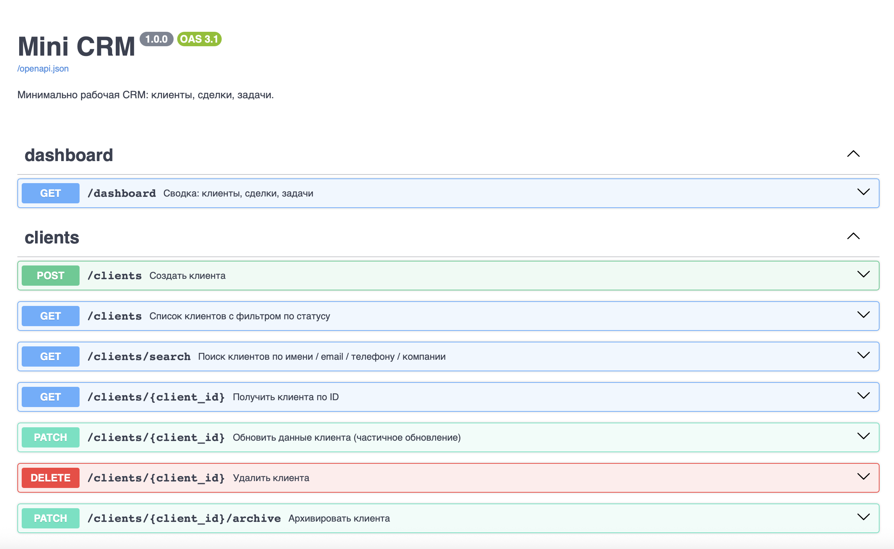
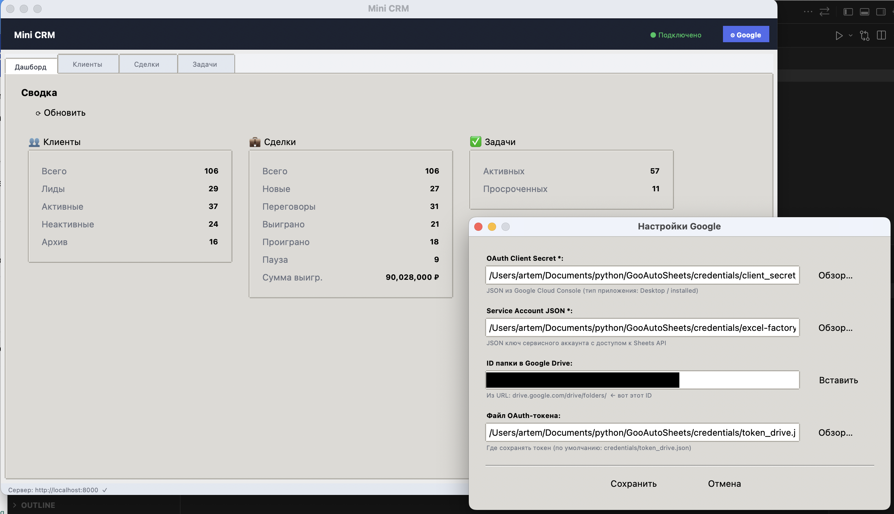
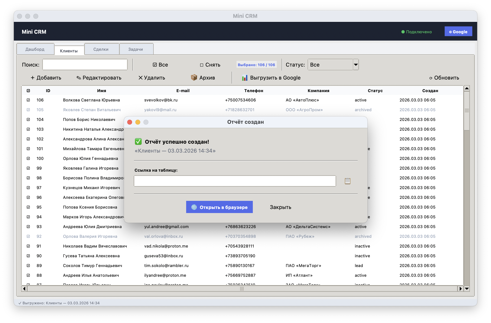
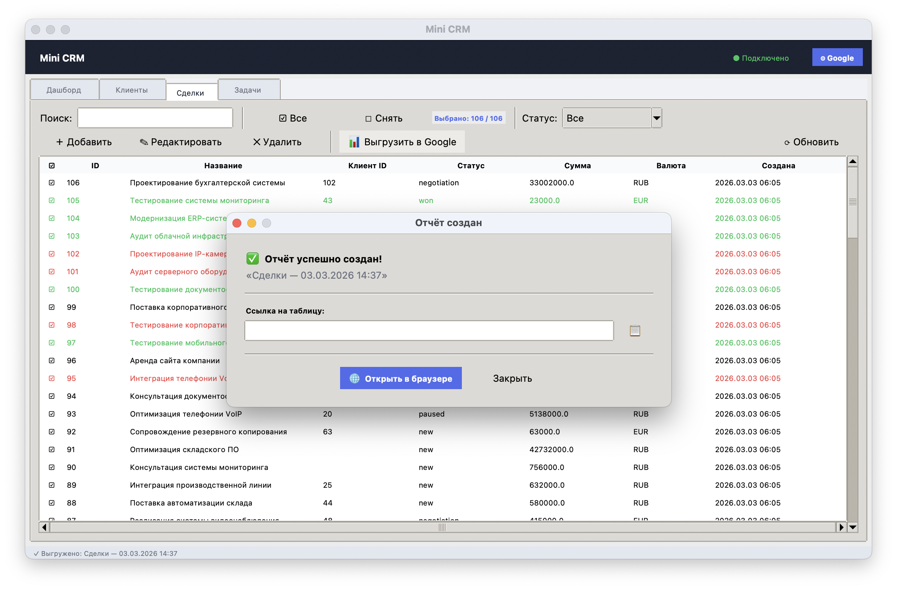
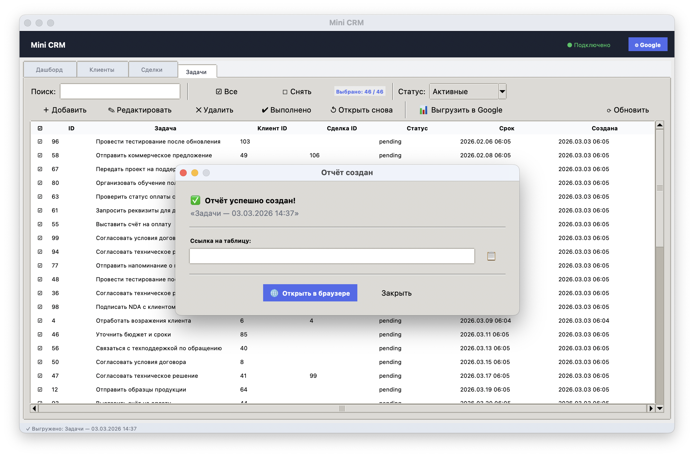
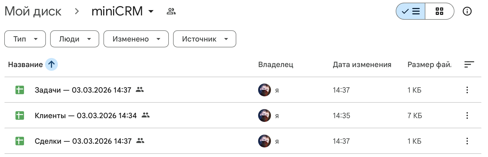
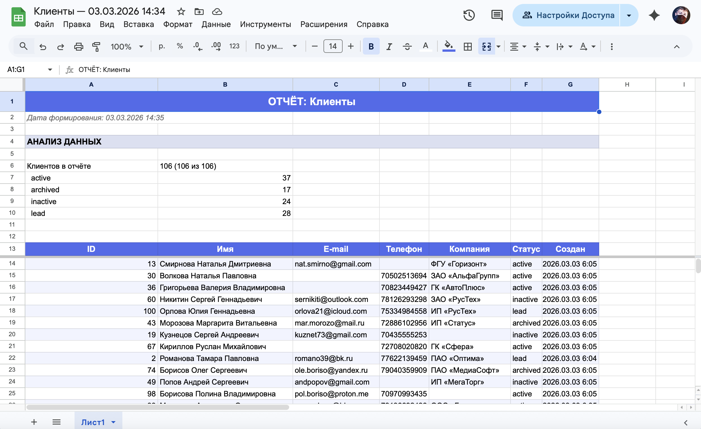
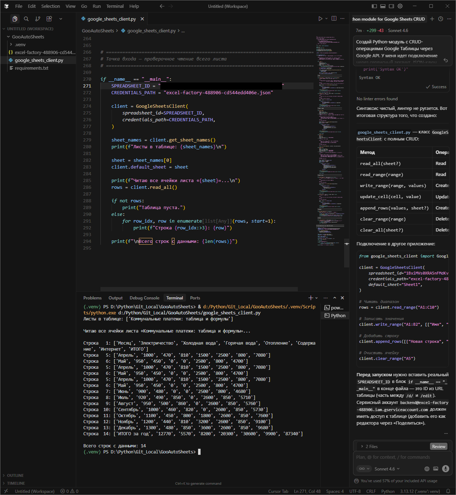
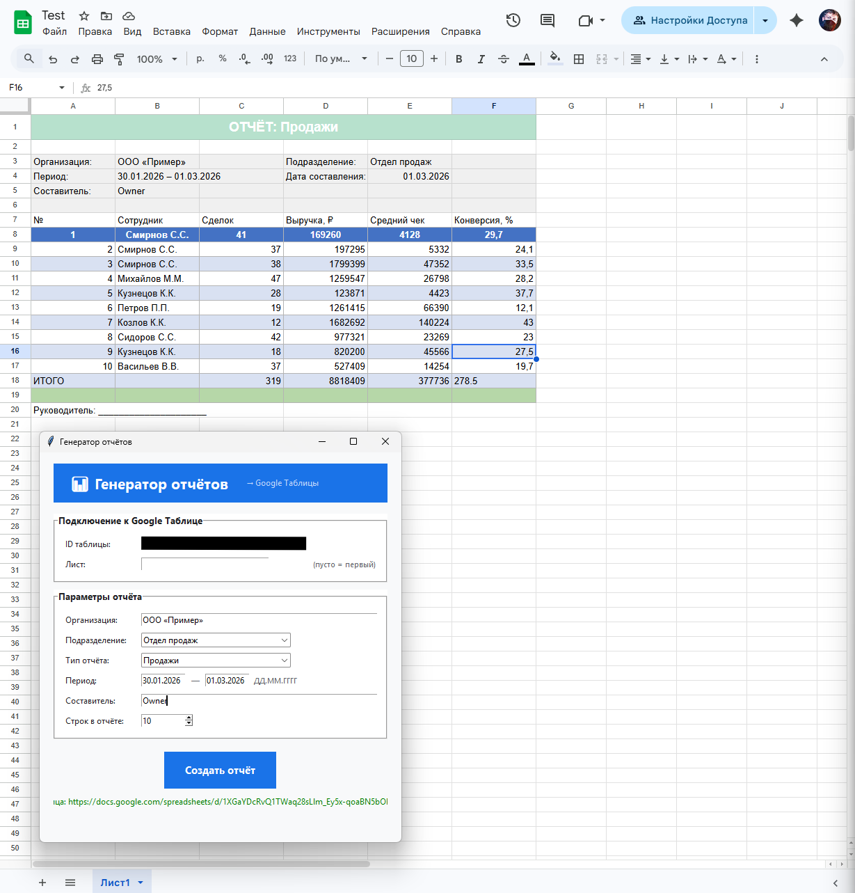

# Mini CRM

Десктопная CRM-система с FastAPI-бэкендом, Tkinter-интерфейсом и интеграцией Google Drive / Google Sheets для экспорта отчётов.

---

## Возможности

- Управление **клиентами**, **сделками** и **задачами** (создание, редактирование, архивация, удаление)
- **Поиск** по всем сущностям
- **Чекбоксы** для выборочных и пакетных операций (архивация/удаление/экспорт нескольких записей сразу)
- **Экспорт в Google Sheets** прямо из интерфейса: создаётся оформленная таблица с заголовком, блоком аналитики и данными
- Бэкенд в **Docker** с горячей перезагрузкой при изменении кода
- Скрипт заполнения тестовыми данными

---

## Архитектура

```
┌──────────────────────┐          HTTP/REST         ┌──────────────────────────┐
│   start_gui.py       │ ─────────────────────────► │  FastAPI (Docker)        │
│   Tkinter GUI        │ ◄─────────────────────────  │  backend/api.py          │
│                      │       JSON responses        │  backend/database.py     │
│   APIClient          │                             │  SQLite  (data/crm.db)   │
│   ExportService      │                             └──────────────────────────┘
│   GoogleSettings     │
└──────────┬───────────┘
           │
           │  Google export flow
           ▼
┌──────────────────────────────────────────────────────┐
│  integrations/                                       │
│                                                      │
│  GoogleDriveOAuthClient  ──► создаёт таблицу         │
│  (OAuth2, от имени пользователя)   в Drive           │
│                                                      │
│  GoogleSheetsClient      ──► заполняет данными       │
│  (Service Account)             и форматирует         │
└──────────────────────────────────────────────────────┘
```

**Почему два Google-клиента?**
Google Sheets API позволяет Service Account писать данные, но файл при этом попадает в Drive сервисного аккаунта, а не пользователя. Чтобы таблица появилась в личном Drive — её создаёт OAuth-клиент от имени пользователя; далее сервисный аккаунт получает доступ и заполняет данными.

---

## Структура проекта

```
GooAutoSheets/
├── backend/
│   ├── api.py            # FastAPI — 20 REST-эндпоинтов (клиенты, сделки, задачи)
│   ├── database.py       # CRMDatabase — все CRUD-операции через SQLite 3
│   ├── models.py         # DDL-схемы таблиц + Pydantic-модели
│   └── Dockerfile        # Образ для бэкенда (python:3.12-slim)
├── integrations/
│   ├── google_sheets_client.py   # Google Sheets API v4 (сервисный аккаунт)
│   ├── google_drive_client.py    # Google Drive API v3 (сервисный аккаунт + OAuth2)
│   └── report_app.py             # Автономный прототип генератора отчётов
├── data/
│   ├── crm.db            # SQLite-база (создаётся автоматически, не в git)
│   └── google_settings.json  # Пути к ключам Google (сохраняются через GUI)
├── credentials/          # JSON-ключи Google (не в git)
├── screenshots/          # Скриншоты пошаговой настройки Google API
├── start_gui.py          # Tkinter-приложение (главный файл запуска GUI)
├── seed_data.py          # Скрипт генерации тестовых данных
├── docker-compose.yml    # Оркестрация бэкенда
├── requirements.txt      # Зависимости Python
├── env-example           # Шаблон переменных окружения
└── .gitignore            # Исключает data/, credentials/, .env, __pycache__
```

---

## Быстрый старт

### 1. Виртуальное окружение

```bash
# macOS / Linux
python -m venv .venv
source .venv/bin/activate

# Windows
python -m venv .venv
.venv\Scripts\activate

pip install -r requirements.txt
```

### 2. Переменные окружения (опционально)

Файл `.env` нужен только если вы используете модули из `integrations/` напрямую (вне GUI). Для запуска GUI и бэкенда он не требуется — настройки Google задаются через кнопку ⚙ внутри приложения.

```bash
cp env-example .env
# Откройте .env и укажите пути к файлам ключей Google
```

| Переменная | Назначение |
|---|---|
| `GOOGLE_CREDENTIALS_PATH` | Путь к JSON-ключу сервисного аккаунта |
| `GOOGLE_SPREADSHEET_ID` | ID существующей таблицы (для прямого доступа через `GoogleSheetsClient`) |
| `GOOGLE_OAUTH_CLIENT_SECRET` | Путь к `client_secret_*.json` для OAuth2 |
| `GOOGLE_OAUTH_TOKEN_PATH` | Куда сохранять токен пользователя (создаётся автоматически) |
| `GOOGLE_DRIVE_FOLDER_ID` | *(Опционально)* ID папки Drive для размещения новых таблиц |

### 3. Запустить бэкенд (Docker)

```bash
docker compose up -d
```

Бэкенд поднимается на `http://localhost:8000`. При изменении файлов в `backend/` сервер перезапускается автоматически (watchfiles + uvicorn `--reload`).

Проверить работу: `http://localhost:8000/docs` — Swagger UI со всеми эндпоинтами.

> **Сменить порт:** установите переменную `CRM_PORT` перед запуском:
> ```bash
> CRM_PORT=9000 docker compose up -d
> ```

### 4. Запустить GUI

```bash
python start_gui.py
```

При старте GUI автоматически проверяет доступность бэкенда. Если бэкенд не запущен — появляется предупреждение, но приложение всё равно открывается.

---

## Заполнить базу тестовыми данными

```bash
# Стандартно — ~1000 записей в каждую таблицу
python seed_data.py

# Задать количество вручную
python seed_data.py --count 500

# Другой адрес бэкенда
python seed_data.py --url http://localhost:8000
```

---

## Интерфейс

### Вкладки

| Вкладка | Описание |
|---|---|
| Дашборд | Сводная статистика: количество записей по статусам, сумма выигранных сделок, просроченные задачи |
| Клиенты | Список клиентов; статусы: `lead`, `active`, `inactive`, `archived` |
| Сделки | Список сделок с суммами; статусы: `new`, `negotiation`, `won`, `lost`, `paused` |
| Задачи | Список задач; статусы: `pending`, `in_progress`, `done`, `cancelled` |

### Тулбар каждой вкладки

**Строка 1 — поиск и выбор:**
```
[Поиск: ___] | [☑ Все] [☐ Снять] [Выбрано: N / M] | [Фильтр статуса ▾]
```

**Строка 2 — действия:**
```
[＋ Добавить] [✎ Редактировать] [✕ Удалить] [📦 Архив] | [📊 Выгрузить в Google]   ⟳
```

### Чекбоксы и пакетные операции

- **Кликнуть ☐ в строке** — отметить/снять одну запись
- **☑ Все** — отметить все строки на вкладке
- **☐ Снять** — снять все отметки
- **Удалить / Архивировать / Выполнить** — при наличии отметок применяется ко **всем отмеченным**; если ничего не отмечено — к выбранной строке
- **📊 Выгрузить в Google** — экспортирует отмеченные строки (или все, если ничего не выбрано)

---

## Экспорт в Google Sheets

### Структура создаваемой таблицы

```
Строка 1  │ ОТЧЁТ: Клиенты              (слитые ячейки, синий фон, белый жирный 14pt)
Строка 2  │ Дата формирования: …        (серый курсив)
Строка 3  │ (пусто)
Строка 4  │ АНАЛИЗ ДАННЫХ               (слитые, голубовато-серый фон, жирный)
Строка 5  │ (пусто)
Строки 6… │ Метрика  │  Значение        (аналитика по статусам и суммам)
…         │ (2 пустых строки)
Строка N  │ ID │ Имя │ … │ Статус       (синий заголовок, закреплён при скролле)
Строки …  │ данные                      (чередующиеся полосы)
```

### Настройка Google (кнопка ⚙ Google в шапке)

| Поле | Описание |
|---|---|
| OAuth Client Secret JSON | Файл `client_secret_*.json` — для создания таблицы от имени пользователя |
| Service Account JSON | Файл ключа сервисного аккаунта — для записи данных |
| ID папки Drive | *(Опционально)* ID папки, куда сохранять таблицы |

Настройки сохраняются в `data/google_settings.json` и загружаются автоматически при следующем запуске.

### Подготовка ключей Google

**OAuth 2.0 (для создания файлов от имени пользователя):**
1. [Google Cloud Console](https://console.cloud.google.com/) → API и сервисы → Учётные данные

   

2. Создать **OAuth 2.0 Client ID** → тип «Desktop app»

   
   
   

3. Скачать JSON, указать путь в настройках GUI

   
   

4. При первом экспорте откроется браузер — авторизуйтесь; токен сохранится в `credentials/token_drive.json`

   

**Сервисный аккаунт (для записи данных):**
1. Google Cloud Console → IAM → Сервисные аккаунты → Создать → скачать JSON-ключ

   

2. Включить **Google Sheets API** и **Google Drive API**
3. Расшарить целевую папку Drive на email сервисного аккаунта (роль «Редактор»)

   

4. Указать путь к ключу в настройках GUI

---

## API бэкенда

Бэкенд доступен по адресу `http://localhost:8000`. Полная документация: `http://localhost:8000/docs`.

| Метод | Путь | Описание |
|---|---|---|
| GET | `/dashboard` | Общая статистика |
| GET / POST | `/clients` | Список / создание клиентов |
| GET / PUT / DELETE | `/clients/{id}` | Получить / обновить / удалить клиента |
| POST | `/clients/{id}/archive` | Архивировать клиента |
| GET | `/clients/search` | Поиск клиентов (iLike) |
| GET / POST | `/deals` | Список / создание сделок |
| GET / PUT / DELETE | `/deals/{id}` | Получить / обновить / удалить сделку |
| GET | `/deals/search` | Поиск сделок |
| GET / POST | `/tasks` | Список / создание задач |
| GET / PUT / DELETE | `/tasks/{id}` | Получить / обновить / удалить задачу |
| POST | `/tasks/{id}/complete` | Отметить задачу выполненной |
| POST | `/tasks/{id}/reopen` | Переоткрыть задачу |

---

## Модули Google-интеграции

Находятся в `integrations/` и используются напрямую из GUI.

### `google_sheets_client.py`

```python
from google_sheets_client import GoogleSheetsClient

client = GoogleSheetsClient(
    spreadsheet_id="<ID таблицы>",
    credentials_path="excel-factory-key.json",
)
client.default_sheet = client.get_sheet_names()[0]  # автоопределение имени листа

client.write_range("A1", [["Имя", "Сумма"], ["Иванов", 50000]])
client.read_all()
client.get_sheet_names()
client.get_sheet_id()
client.batch_update([...])
```

### `google_drive_client.py`

Содержит два класса.

**`GoogleDriveClient`** — работает через сервисный аккаунт:

```python
from google_drive_client import GoogleDriveClient

drive = GoogleDriveClient(credentials_path="service_account.json")

drive.list_files(folder_id="<FOLDER_ID>")    # список файлов
drive.upload_file("report.xlsx", folder_id="<FOLDER_ID>")
drive.create_folder("Отчёты 2026", parent_id="<FOLDER_ID>")
drive.rename_file("<FILE_ID>", "Новое название")
drive.move_file("<FILE_ID>", new_parent_id="<FOLDER_ID>")
drive.trash_file("<FILE_ID>")   # в корзину
drive.delete_file("<FILE_ID>")  # удалить насовсем
```

**`GoogleDriveOAuthClient`** — наследует `GoogleDriveClient`, но авторизуется через OAuth2 (файл создаётся в Drive пользователя):

```python
from google_drive_client import GoogleDriveOAuthClient

oauth = GoogleDriveOAuthClient(
    client_secret_path="client_secret_*.json",
    token_path="credentials/token_drive.json",
)
meta = oauth.create_spreadsheet("Отчёт за март 2026", folder_id="<FOLDER_ID>")
print(meta["id"])           # передаётся в GoogleSheetsClient
print(meta["webViewLink"])  # ссылка для открытия
```

При первом вызове `create_spreadsheet` откроется браузер для авторизации. Токен сохранится в `token_path` и повторная авторизация не потребуется.

### `report_app.py`

Автономный Tkinter-прототип генератора отчётов — не зависит от основного CRM-приложения. Запускается отдельно:

```bash
python integrations/report_app.py
```

Позволяет сгенерировать демонстрационные отчёты (Продажи, Производство, HR) со случайными данными прямо в существующую Google Таблицу. Использует `ReportBuilder` для форматирования блоков данных — удобная точка отсчёта для разработки собственных шаблонов отчётов.

---

## Требования

- Python 3.10+
- Docker Engine (для бэкенда)
- Зависимости: `fastapi`, `uvicorn[standard]`, `pydantic>=2.0`, `requests`, `watchfiles`, `google-api-python-client`, `google-auth`, `google-auth-oauthlib`, `python-dotenv`

---

## Устранение неполадок

**GUI запустился, но данные не загружаются**

Убедитесь, что бэкенд запущен: `docker compose ps`. Если контейнер не стартует — проверьте `docker compose logs api`.

**`docker compose up -d` падает с ошибкой порта**

Порт 8000 занят другим процессом. Укажите другой порт:
```bash
CRM_PORT=9000 docker compose up -d
```
И обновите адрес бэкенда в коде GUI (`APIClient`) или через переменную окружения.

**Ошибка `403 Forbidden` при экспорте в Google Sheets**

Сервисный аккаунт не имеет прав на таблицу или папку. Убедитесь, что папка Drive расшарена на email сервисного аккаунта (роль «Редактор»).

**Браузер не открывается при OAuth-авторизации**

Проверьте, что путь к `client_secret_*.json` указан верно в настройках GUI. Файл должен быть типа «Desktop app», а не «Web application».

**Токен OAuth устарел / `invalid_grant`**

Удалите файл `credentials/token_drive.json` и выполните экспорт повторно — браузер откроется снова для повторной авторизации.

**`seed_data.py` завершается с ошибкой подключения**

Бэкенд должен быть запущен до заполнения базы. По умолчанию скрипт обращается к `http://localhost:8000`; укажите другой адрес через `--url`, если изменили порт.
